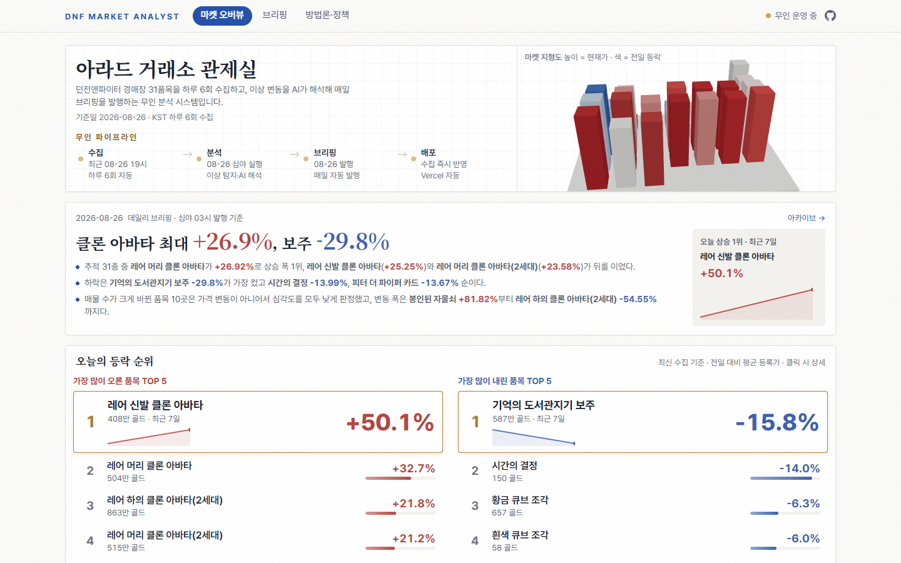
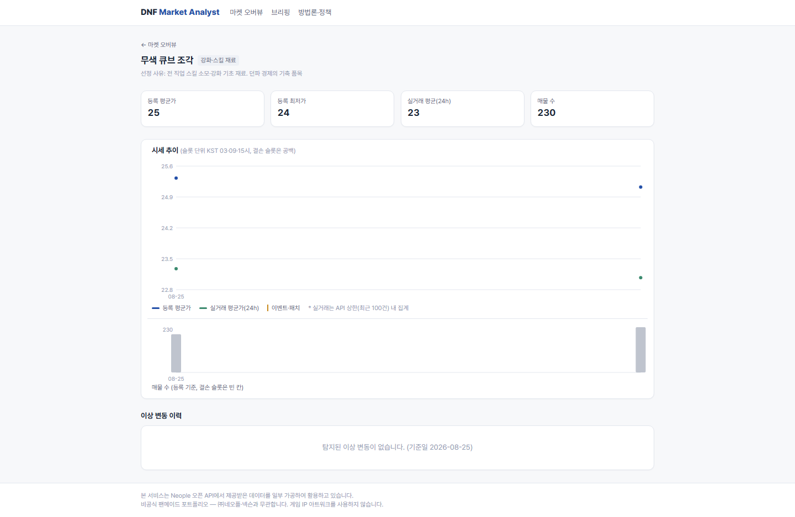
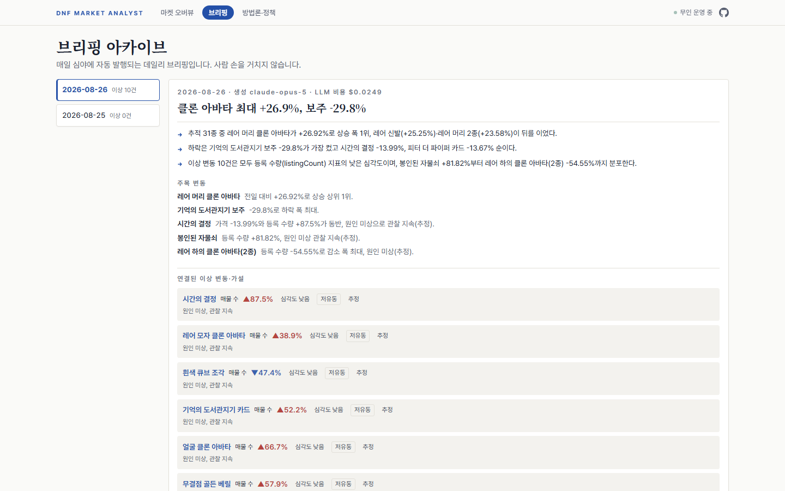

# DNF Market Analyst — 던파 라이브 마켓 애널리스트

> 기존 던파 시세 서비스가 "지금 얼마인지"를 보여주는 **조회 도구**라면, 본 시스템은
> **"왜 움직였고, 무엇을 주목해야 하는지"를 해석해 데일리 브리핑으로 만드는 분석 시스템**이다.

던전앤파이터 경매장 시세를 매일 자동 수집하고, 이상 변동을 탐지하면 AI가 공식 공지·이벤트를
교차해 원인 가설을 근거 URL·신뢰도와 함께 작성, 데일리 브리핑을 무인 발행한다.

**Live**: https://dnf-market-analyst.vercel.app

형제 프로젝트: [Arad Census](https://github.com/Yegeon99/arad-census), 시장에 이어 **유저**를 보는 캐릭터 표본조사 **7화면 인터랙티브 리포트**.

> 🟢 **운영 중 시스템** — 본 대시보드는 매일 자동으로 데이터가 추가된다.
> 수집 시작일 2026-08-25 · 하루 6회(KST 03/07/11/15/19/23시) 자동 수집 · 심야 자동 분석·브리핑 발행.

| 마켓 오버뷰 | 아이템 상세 | 브리핑 아카이브 |
|---|---|---|
|  |  |  |

## 아키텍처 — 사람 손 없이 매일 갱신되는 구조

Neople 오픈 API는 시세 **히스토리를 제공하지 않는다**. 그래서 스냅샷 축적 구조를 직접 설계했다.
수집 시작일이 곧 데이터 자산의 시작이다.

```
Neople 오픈 API (경매장 등록가 · 판매 완료)
        │
        ▼  GitHub Actions cron — 하루 6회 (KST 03/07/11/15/19/23시)
collect.py ──▶ data/snapshots/*.json  (31품목, 호출 62회/회, 집계 수치만 저장)
        │
        ▼
aggregate.py ──▶ data/timeseries.json  (슬롯 중복 방지 멱등 병합)
        │
        ▼  심야 슬롯(03시)에서만 — daily.yml
detect.py ──▶ 규칙 기반 이상 탐지 ──▶ data/anomalies.json
        │
        ▼  이상 항목만 (전 품목 LLM 호출 금지)
interpret.py ──▶ ±3일 공지·이벤트 교차 → AI 원인 가설 (근거 URL + 확정/추정)
        │
        ▼
briefing.py ──▶ 데일리 브리핑 발행 ──▶ data/briefings.json
        │
        ▼  Actions 봇이 data/ 경로만 커밋
   git push ──▶ Vercel 자동 재배포 ──▶ 대시보드 갱신 (무인 운영)
```

수집·분석·발행·배포 전 과정이 자동이다. 이 저장소의 커밋 로그가 곧 무인 운영의 증명이다.

## 이상 탐지 기준 (전체 공개)

임계치는 [`config/thresholds.json`](config/thresholds.json)에서 관리한다.

| 규칙 | 지표 | 낮음 | 중간 | 높음 |
|---|---|---|---|---|
| 전일 대비 | 평균 등록가 | ±8% | ±15% | ±30% |
| 전일 대비 | 매물 수 | ±30% | ±50% | ±100% |
| 7일 이동평균 이탈* | 평균 등록가 | — | ±12% | ±25% |
| 7일 이동평균 이탈* | 매물 수 | — | ±40% | ±80% |

\* 품목별 데이터 7일 이상 축적 시 자동 활성화 (그 전에는 전일 대비만 적용)

**저유동 보정** — 매물 30건 미만 품목은 소수 등록·거래만으로 지표가 급변할 수 있다.
당일 연속 2슬롯 지속 변동일 때만 "중간" 이상 심각도를 유지하고, 대시보드에 `저유동` 뱃지로
해석 주의를 안내한다. 매물 5건 미만이 이틀 연속이면 가격 신호 자체를 채택하지 않는다.

**AI 정직성** — 가설은 수동 큐레이션한 공식 공지(±3일)만 근거로 하며 근거 URL과
신뢰도(확정/추정)를 반드시 병기한다. 근거가 없으면 **"원인 미상, 관찰 지속"** 으로 남긴다.
시점 일치를 인과로 단정하지 않는다. 수집 실패 슬롯은 차트에 공백으로 그대로 표기한다.

## 추적 품목 31종 — 선정 근거

전 품목이 아니라 시장 대표성 있는 품목을 선정하고 근거를 문서화했다
([`config/items.json`](config/items.json)에 품목별 선정 사유 기록).

- **강화·스킬 재료** (6종): 무색·흑색·흰색·황금 큐브 조각, 하급·상급 원소결정 — 전 직업 소모 기초재, 던파 경제의 기축
- **증폭 재료** (2종): 순수한 증폭서, 농밀한 이계의 정수 — 고점 수요·이벤트 민감
- **성장 재료** (5종): 시간의 결정, 균열의 단편 등 — 시즌 콘텐츠 수급 직결
- **마법부여** (4종): 도서관지기 카드·보주 등 — 고가 저유동, 패치 민감
- **레어·일반 아바타** (14종): 클론 아바타 부위별 — 아바타 상자 이벤트에 즉각 반응

64종 후보를 실매물 검증(2일 연속 매물 존재)으로 걸러 31종을 확정했다.

## LLM 비용 실측

| 단계 | 모델 | 실측 비용 |
|---|---|---|
| 이상 해석 | claude-haiku-4-5 | $0.0010 / 건 (in 760 · out 48 tok) |
| 브리핑 생성 | claude-opus-5 | $0.0133 / 회 (in 662 · out 398 tok) |
| **최악 하루** (이상 10건 + 브리핑) | | **$0.0233** |

- LLM은 **이상 탐지된 항목에만** 호출한다 (전 품목 호출 금지)
- 이상 0건인 날은 무비용 규칙 기반 "안정 구간" 브리핑 (억지 이슈 생성 금지)
- 일 상한 $0.30 초과 시 실행을 자동 중단하고 로그로 보고 (`pipeline/llm.py`)
- 브리핑별 비용은 대시보드에 그대로 공개된다

## 데이터 정책

- API 원본 응답을 저장하지 않는다 — 분석에 필요한 **집계 수치만** 축적
  (최저/평균 단가, 매물 수, 24h 판매 수·평균)
- API 매너: 호출 간 대기 0.3s, 재시도 1회 제한, 하루 6회 수집(372호출/일), 품목 수 상한 — 절제 설계 자체를 공개
- 수집 시작(2026-08-25) 이전 구간은 판매완료 API를 소급해 **실거래만 일 단위 백필** (source: "backfill"로 구분,
  등록가·매물수는 소급 불가 — 차트·방법론 페이지에 백필 사실 명시)
- 매물 수는 조회 상한(400건), 실거래는 최근 100건 상한 내 집계 — 한계도 그대로 표기
- 게임 아트워크·로고 미사용. 비상업 개인 포트폴리오

## 실행

```bash
# 파이프라인 (Python 3.11)
python -m venv .venv && .venv/Scripts/pip install -r requirements.txt
.venv/Scripts/python pipeline/run_daily.py   # 수집→집계→탐지→해석→브리핑

# 대시보드 (Node 20+)
cd dashboard && npm install && npm run dev   # predev가 data/를 public/으로 동기화
```

환경변수: `.env`에 `NEOPLE_API_KEY`, `ANTHROPIC_API_KEY` (Actions에서는 GitHub Secrets).

---

**이 서비스는 Neople 오픈 API에서 제공받은 데이터를 일부 가공하여 활용하고 있습니다.**
데이터 출처: [Neople 오픈 API](https://developers.neople.co.kr)

본 프로젝트는 **비공식 팬메이드 포트폴리오**이며 ㈜네오플·㈜넥슨코리아와 무관합니다.
